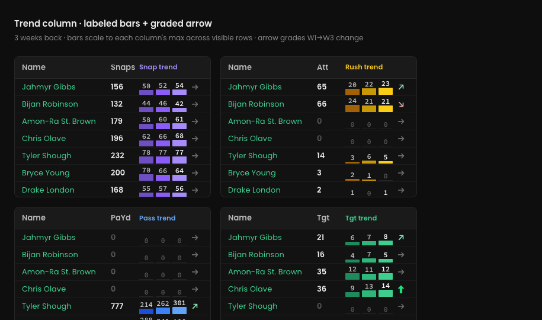
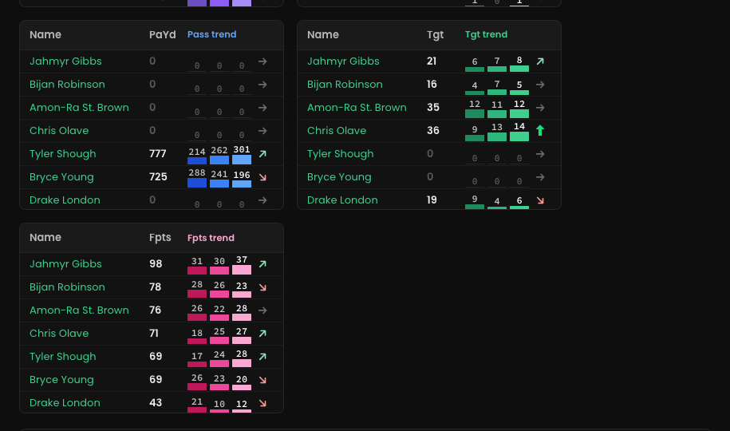
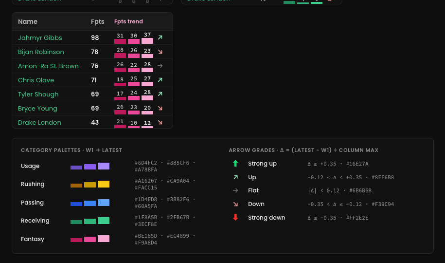
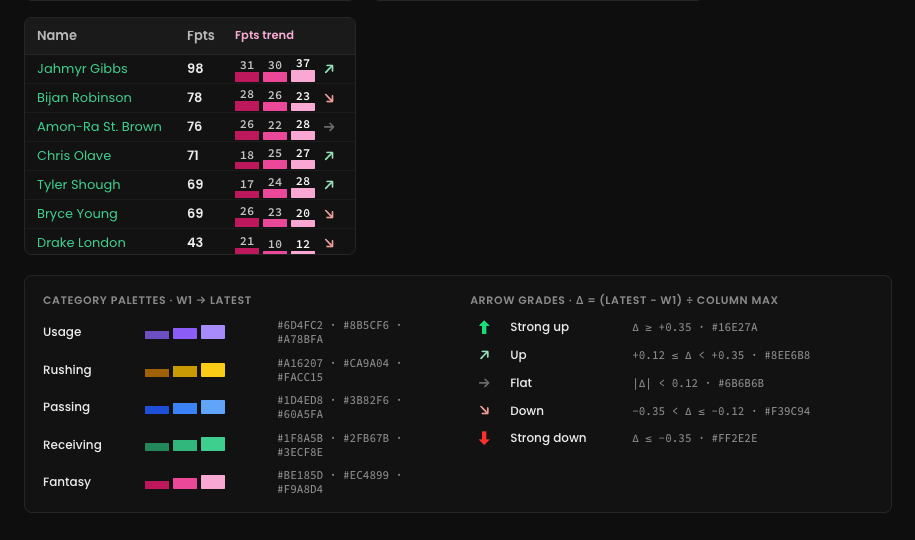

# Bowser — Trend Column (labeled bars + graded arrow)

Scope: **only** the trend cell renderer used by every `* trend` column (Snap trend, Rush trend, Pass trend, Tgt trend, Fpts trend, and any other per-week trend column). Nothing else on any page changes. Prototype is the source of truth: `prototype/Bowser Trend Column.dc.html`.



## 1. What changes
- Each week's bar gets its **value printed above it** (12px Source Code Pro, 600).
- Bars scale to the **column-wide max across visible rows**, not the row's own max, so bar height is comparable between players.
- A **graded arrow** sits right of the bars: five levels (strong up / up / flat / down / strong down), color vibrancy scales with the size of the change.
- Each stat group gets its own **bar palette** (3 shades, W1 → latest). Fantasy is pink, Rushing yellow, Passing blue, Receiving green, Usage purple.
- Values are **whole numbers** everywhere, including Fpts (round half up).

## 2. Anatomy
```
 50   52   54  →      ← values 12px mono; latest week white, earlier #C4C4C4, zero #5A5A5A
 ▇▇   ▇▇   ▇▇         ← bars 24px wide, 2–12px tall on column max, 4px gap; shades W1→W3
 └ 24 ┘ 4  └ 16px arrow, 2px left margin
```
- Cell: `display:flex; gap:4px; align-items:flex-end; height:26px` inside a 28px row.
- Per-week slot: `width:24px; flex-column; align-items:center; justify-content:flex-end; gap:1px`.
- Bar: `height = value ? 2 + round(value / columnMax × 10) : 1` px, `border-radius:1px`. Zero → 1px `#2A2A2A` hairline.
- Column width for N weeks = `N × 28 + 20 + 4` px (3 weeks → 108px). Current column is ~70px; widen it.
- Arrow slot: `width:16px; height:26px; inline-flex center; font-weight:700; line-height:1; margin-left:2px`.

## 3. Palettes (W1 · W2 · latest)
| Group | W1 | W2 | Latest (also header text) |
|---|---|---|---|
| Usage (Snaps, Snp%, routes…) | `#6D4FC2` | `#8B5CF6` | `#A78BFA` |
| Rushing | `#A16207` | `#CA9A04` | `#FACC15` |
| Passing | `#1D4ED8` | `#3B82F6` | `#60A5FA` |
| Receiving | `#1F8A5B` | `#2FB67B` | `#3ECF8E` |
| Fantasy | `#BE185D` | `#EC4899` | `#F9A8D4` |

With more than 3 weeks back, the earliest weeks reuse the W1 shade; the last three weeks use W1/W2/latest.




## 4. Arrow grades
`Δ = (latest − first) ÷ columnMax` (columnMax = largest single-week value in that column across visible rows). A row whose sum is 0 renders Flat.

| Grade | Glyph | Size | Color | Rule |
|---|---|---|---|---|
| Strong up | ⬆ (U+2B06) | 15px | `#16E27A` | Δ ≥ +0.35 |
| Up | ↗ (U+2197) | 14px | `#8EE6B8` | +0.12 ≤ Δ < +0.35 |
| Flat | → (U+2192) | 14px | `#6B6B6B` | \|Δ\| < 0.12 |
| Down | ↘ (U+2198) | 14px | `#F39C94` | −0.35 < Δ ≤ −0.12 |
| Strong down | ⬇ (U+2B07) | 15px | `#FF2E2E` | Δ ≤ −0.35 |

Tooltip on the arrow: `"{grade} · Δ +0.21 of column max 68"`. Thresholds live in one constant so they can be tuned.



## 5. Data
- Input per cell: `number[]` of per-week values (oldest → newest), already what the bars use today.
- `columnMax` is computed per trend column over the currently filtered/visible rows; recompute on filter, sort, page size, and weeks-back change.
- Sorting a trend column sorts by Δ (signed), ties by latest value.

## 6. Acceptance
- [ ] Every trend cell shows one value per week above its bar; latest week label is `#FFFFFF`.
- [ ] Bars in a column share one scale; the tallest bar in the column is 12px.
- [ ] Group palettes match §3; header label uses the group's latest shade.
- [ ] Arrow present on every cell with five distinct glyph/color grades per §4; zero rows show grey →.
- [ ] Fpts and all other values render as whole numbers.
- [ ] Row height unchanged (28px); trend column widened to `N×28+24` px.
- [ ] Weeks-back 2–5 all render without overflow.
- [ ] Fonts: Source Code Pro for values, Poppins elsewhere; nothing outside trend cells changes.
